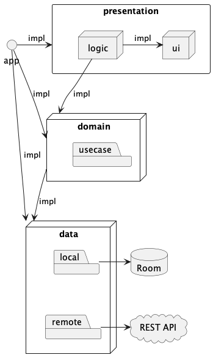

# ✨CurrencyConverter✨

## _Project documentation_

### Project structure

##### Project modules

- app: **entry point**. Binds all together and sets up DI;
- data: **database|server communication layer**. Describes DAO and network interfaces;
- domain: **business logic layer**. Describes usecases, business models, navigation interfaces;
- presentation: **ui layer**. Consists of two sub-modules: **ui**, **logic**; -- logic: implements
  ViewModels, rules navigation; -- ui: implements screens, describes ViewModel APIs, styles, master
  components, ui utils.

## TBD

- Move strings to resources and move some magic variables to constants;
- Refactor error handling, not each error is user-friendly;
- Create class diagram and refactor models;
- Some refactor needed;
- Add UI tests with Kaspresso;
- Add unit tests for ViewModels (isolated) and UseCases (only network is mocked).

## Feel free to discuss the solution!